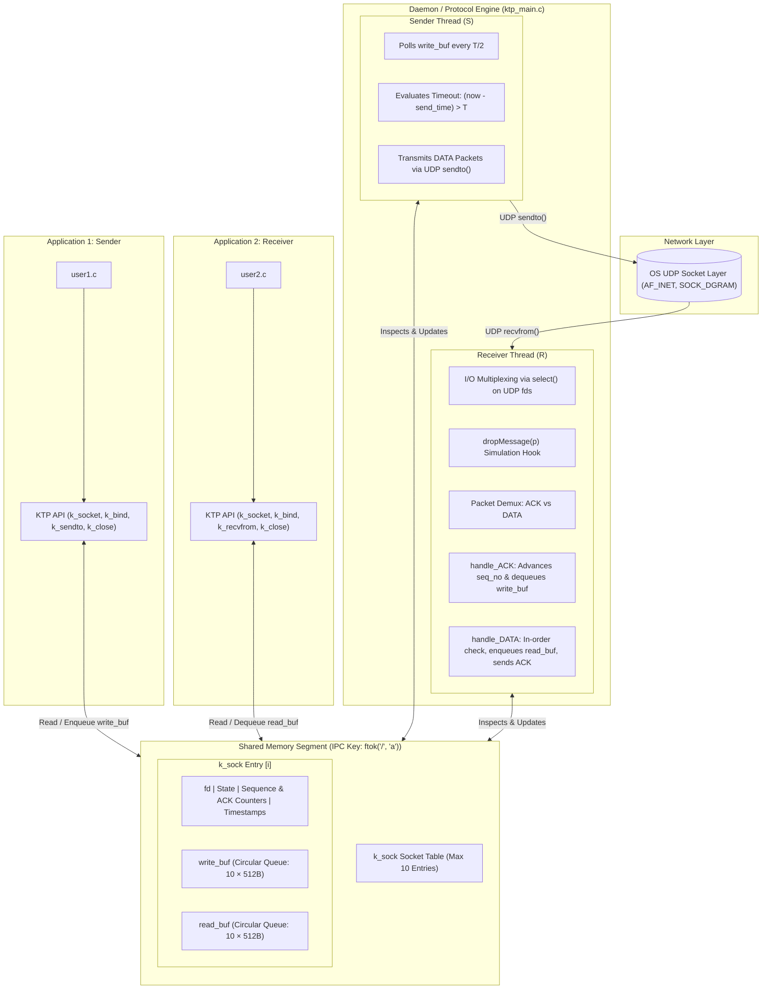
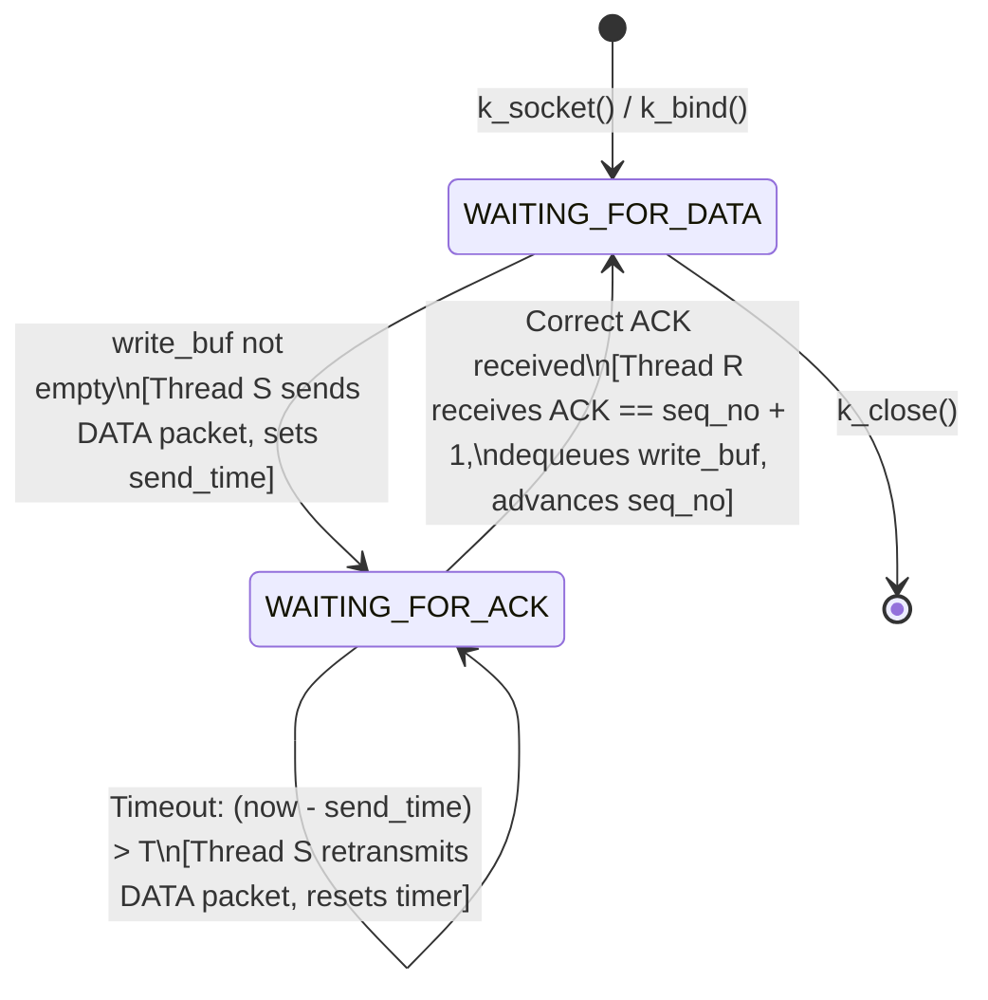

# KTP: KGP Transport Protocol
---

## Overview

**KTP (KGP Transport Protocol)** is a custom, user-space transport layer protocol designed to provide **end-to-end reliable, in-order, message-oriented communication** on top of the unreliable UDP datagram service (`SOCK_DGRAM`). 

Traditional UDP does not guarantee packet delivery, ordering, or protection against duplication. KTP bridges this gap by introducing:
- **Message-oriented Framing**: Fixed 512-byte atomic payloads without stream fragmentation issues.
- **Reliability & Sequencing**: Explicit sequence numbering (modulo 256) and positive acknowledgments (ACK).
- **Timeout-Driven ARQ (Automatic Repeat reQuest)**: Retransmission mechanism triggered by a configurable timeout period ($T$).
- **Multi-Process Shared Architecture**: A central shared-memory daemon managing socket control blocks, sender queues, and receiver queues across independent application processes.
- **Controlled Packet Loss Simulation**: A probabilistic packet-dropping utility (`dropMessage`) allowing controlled stress-testing across synthetic packet loss rates ($p \in [0.05, 0.50]$).

---

## Architecture & Design

KTP emulates transport-layer socket abstractions in user space using **POSIX Shared Memory (IPC)** and a **Dual-Threaded Protocol Engine**.



---

## Packet Framing & Wire Format

KTP packets are transmitted as UDP datagram payloads. The protocol defines two types of packets: **DATA** and **ACK**.

### 1. Packet Structure (Wire Format)

```
 0                   1                   2                   3
 0 1 2 3 4 5 6 7 8 9 0 1 2 3 4 5 6 7 8 9 0 1 2 3 4 5 6 7 8 9 0 1
+-+-+-+-+-+-+-+-+-+-+-+-+-+-+-+-+-+-+-+-+-+-+-+-+-+-+-+-+-+-+-+-+
|   FLAG (1B)   |  SEQ_NO (1B)  |  ACK_NO (1B)  |               |
+-+-+-+-+-+-+-+-+-+-+-+-+-+-+-+-+-+-+-+-+-+-+-+-+               +
|                                                               |
|                 PAYLOAD DATA (Up to 512 Bytes)                |
|                      (Only in DATA packets)                   |
|                                                               |
+-+-+-+-+-+-+-+-+-+-+-+-+-+-+-+-+-+-+-+-+-+-+-+-+-+-+-+-+-+-+-+-+
```

### 2. Header Fields

| Field | Size | Description |
| :--- | :--- | :--- |
| `FLAG` | 1 Byte | Packet identifier: `DATA (1)` for data packets, `ACK (0)` for acknowledgments. |
| `SEQ_NO` | 1 Byte | Sequence number of the data packet (1 to 255, wrapping modulo 256). |
| `ACK_NO` | 1 Byte | Acknowledgment sequence number indicating the next expected incoming packet sequence. |
| `DATA` | 0 – 512 Bytes | Application payload string/byte buffer (omitted in standalone ACK packets). |

- **DATA Packet Total Size**: $3 + \text{payload length}$ bytes (maximum 515 bytes).
- **ACK Packet Total Size**: Exactly 3 bytes (`FLAG`, `SEQ_NO`, `ACK_NO`).

---

## Core Data Structures

### 1. Circular Queue (`queue` in `queue.h`)
Manages bounded FIFO message buffering for both transmission and reception:
```c
typedef struct queue {
    char data[BUF_SIZE][MESSAGE_SIZE]; // Array of 10 messages (512 bytes each)
    int front;                         // Index of the current front element
    int back;                          // Index of the current back element
} queue;
```
- `BUF_SIZE`: Fixed capacity of 10 messages.
- `MESSAGE_SIZE`: 512 bytes per atomic payload.
- Empty condition: `front == (back + 1) % BUF_SIZE`.
- Full condition: `front == (back + 2) % BUF_SIZE`.

### 2. Socket Control Block (`k_sock` in `ktp.h`)
Stored inside the shared memory segment (size: `SHM_SIZE = 10` sockets):
```c
typedef struct k_sock {
    int fd;                     // Underlying Linux UDP file descriptor
    uint16_t dest_port;         // Peer port in network byte order
    uint32_t dest_ip;           // Peer IP in network byte order
    uint16_t src_port;          // Local port in network byte order
    uint32_t src_ip;            // Local IP in network byte order
    uint8_t seq_no;             // Current sequence number for outgoing packets
    uint8_t ack_no;             // Expected sequence number for incoming packets
    uint8_t state;              // State: WAITING_FOR_DATA (0) or WAITING_FOR_ACK (1)
    queue read_buf;             // Queue for received messages awaiting k_recvfrom()
    queue write_buf;            // Queue for messages buffered via k_sendto()
    struct timespec send_time;  // CLOCK_MONOTONIC timestamp of last packet transmission
} k_sock;
```

---

## Protocol State Machine & Operations

### State Transitions



### Detailed Sequence Workflow

1. **Connectionless Binding**:
   - `k_socket()` allocates a socket slot in the shared memory segment and creates a UDP datagram socket.
   - `k_bind()` binds the local UDP socket to `src_addr` and stores both source and destination endpoint addresses (`src_ip`, `src_port`, `dest_ip`, `dest_port`) in the `k_sock` table.

2. **Sending (`k_sendto` & Thread `S`)**:
   - Application calls `k_sendto(fd, buf, len, ...)`.
   - The message is validated against the bound destination address and enqueued into `sock->write_buf`.
   - Thread `S` periodically wakes up (sleep interval `T/2`). When `sock->state == WAITING_FOR_DATA` and `write_buf` has data:
     - Assembles packet using `make_packet(DATA, seq_no, ack_no, payload)`.
     - Transmits via UDP `sendto()`.
     - Records transmission timestamp in `sock->send_time`.
     - Transitions to `WAITING_FOR_ACK`.

3. **Receiving & Acknowledging (Thread `R` & `k_recvfrom`)**:
   - Thread `R` uses `select()` across all active socket descriptors.
   - Upon receiving a packet via UDP `recvfrom()`:
     - Calls `dropMessage(p)` to simulate channel packet drops. If dropped, the packet is ignored.
     - If it is an **ACK**:
       - `handle_ACK()` checks if `ack_no == (seq_no + 1) % MAX_SEQ_NO`.
       - If valid, advances `seq_no`, dequeues the acknowledged message from `sock->write_buf`, and transitions back to `WAITING_FOR_DATA`.
     - If it is a **DATA packet**:
       - `handle_DATA()` checks if the packet sequence matches the expected `sock->ack_no`.
       - In-order packet: Enqueues data into `sock->read_buf` and increments `sock->ack_no`.
       - Sends back an immediate standalone ACK containing `sock->ack_no`.
   - The user application calls `k_recvfrom()` which reads from `sock->read_buf` and dequeues the item.

4. **Retransmission on Timeout**:
   - If no ACK is received within timeout period $T$ (default: 2–5 seconds):
   - Thread `S` detects `(current_time - send_time) > T`.
   - Retransmits the packet currently at the head of `write_buf` and resets `send_time`.

---

## API Reference

### User-Facing Library Calls (`ktp.h`)

#### `int k_socket(int domain, int type, int protocol)`
- **Description**: Allocates a KTP socket backed by a UDP file descriptor and initializes an entry in shared memory.
- **Parameters**:
  - `domain`: Address family (must be `AF_INET`).
  - `type`: Socket type (must be `SOCK_KTP = 100`).
  - `protocol`: Protocol specifier (`0`).
- **Return Value**: Socket file descriptor on success, `-1` on failure (e.g. shared memory full or invalid type).

#### `void k_bind(int fd, struct sockaddr *src_addr, socklen_t src_addrlen, struct sockaddr *dest_addr, socklen_t dest_addrlen)`
- **Description**: Binds the socket to local source address/port and associates the fixed remote destination address/port.
- **Parameters**:
  - `fd`: Socket descriptor returned by `k_socket`.
  - `src_addr`: Pointer to `sockaddr_in` containing local IP and port.
  - `src_addrlen`: Size of source address structure.
  - `dest_addr`: Pointer to `sockaddr_in` containing destination IP and port.
  - `dest_addrlen`: Size of destination address structure.

#### `int k_sendto(int fd, const void *buf, size_t len, int flags, const struct sockaddr *dest_addr, socklen_t dest_addrlen)`
- **Description**: Buffers an application message into the socket's `write_buf` for transmission by Thread `S`.
- **Parameters**:
  - `fd`: Socket descriptor.
  - `buf`: Data buffer to send (up to 512 bytes).
  - `len`: Length of buffer.
  - `flags`: Flags (unused, `0`).
  - `dest_addr`: Destination address (must match the address bound with `k_bind`).
  - `dest_addrlen`: Length of destination address.
- **Return Value**: Number of bytes queued on success, `-1` on error (buffer full or address mismatch).

#### `int k_recvfrom(int fd, void *buf, size_t len, int flags, struct sockaddr *src_addr, socklen_t *src_addrlen)`
- **Description**: Retrieves the next delivered in-order message from `read_buf`.
- **Parameters**:
  - `fd`: Socket descriptor.
  - `buf`: Destination buffer.
  - `len`: Buffer capacity.
  - `flags`: Flags (`0`).
  - `src_addr`: Address structure populated with source address.
  - `src_addrlen`: Pointer to address length.
- **Return Value**: Number of bytes copied to `buf`, or `-1` if the queue is empty.

#### `void k_close(int fd)`
- **Description**: Closes the underlying UDP socket and resets the entry in shared memory.

---

## Repository Structure

```
.
├── CS39006_Networks_Lab_Assignment4.pdf  # Lab assignment problem specification
├── documentation.txt                    # Academic submission report with experimental data
├── README.md                            # Complete technical and architectural documentation
├── Makefile                             # Build system for static library, daemon, and users
├── ktp.h                                # Main KTP public header & socket definitions
├── ktp.c                                # KTP library implementation (k_socket, k_bind, etc.)
├── ktp_util.h                           # Internal packet handling and framing headers
├── ktp_util.c                           # Packet serialization, deserialization, ACK/DATA handlers
├── ktp_main.c                           # Central daemon process running threads R and S
├── queue.h                              # Circular buffer data structure header
├── queue.c                              # Circular buffer implementation
├── user1.c                              # Test sender application (transmits messages)
└── user2.c                              # Test receiver application (receives messages)
```

---

## Compilation & Execution Guide

### Prerequisites
- Linux / POSIX-compliant environment (GCC, GNU Make, `pthreads`, System V IPC).
- Appropriate IPC shared memory permissions (`sys/ipc.h`, `sys/shm.h`).

### 1. Building the Project
Use the provided `Makefile` to compile all targets:
```bash
# Build the static library libksocket.a, daemon, and test applications
make all
```

Individual build commands:
```bash
# Compile the static library libksocket.a
make library

# Compile the KTP background daemon (ktp_main)
make daemon

# Compile user applications (user1 and user2)
make users
```

### 2. Execution Flow

#### Step 1: Start the Central Daemon
The daemon must be running before any user process calls `k_socket`:
```bash
./ktp_main
```
*The daemon allocates the shared memory segment, starts Thread `R` and Thread `S`, and waits.*

#### Step 2: Start the Receiver (`user2`)
In a separate terminal window:
```bash
./user2
```
*`user2` creates a KTP socket, binds to port 5001 (listening from 5000), and waits for incoming packets.*

#### Step 3: Start the Sender (`user1`)
In a third terminal window:
```bash
./user1
```
*`user1` creates a KTP socket, binds to port 5000 (targeting 5001), and repeatedly sends messages.*

---

## Experimental Evaluation & Drop Rate Analysis

As part of the assignment requirements, packet transmission efficiency was evaluated across varying simulated packet drop probabilities $p \in [0.05, 0.50]$ with timeout $T = 2\text{s}$.

The metric measured is the **Average Number of Transmissions per Message**:
$$\text{Ratio} = \frac{\text{Total Transmissions Attempted}}{\text{Total Messages Successfully Received}}$$

| Drop Probability ($p$) | Observed Transmissions / Message |
| :---: | :---: |
| **0.05** | 2.7 |
| **0.10** | 1.1 |
| **0.15** | 1.7 |
| **0.20** | 1.6 |
| **0.25** | 2.1 |
| **0.30** | 3.6 |
| **0.40** | 1.7 |
| **0.50** | 3.2 |

### Observations:
1. **Low Drop Rates ($p \le 0.10$)**: Low retransmission overhead; most packets are acknowledged on the initial attempt.
2. **Moderate to High Drop Rates ($p \ge 0.25$)**: Due to loss of either data packets or returning acknowledgments, the sender thread encounters timeouts and retransmits, leading to an increased ratio of transmissions per delivered payload.

---

## Maintenance & IPC Cleanup

If the daemon is terminated abruptly (`kill -9`) without executing its `SIGINT` cleanup handler, the shared memory segment may persist in the OS kernel.

To inspect and release leftover shared memory:
```bash
# List active shared memory segments
ipcs -m

# Remove the segment manually by its shmid
ipcrm -m <shmid>
```

---

## Author & Academic Credentials

- **Name**: Arpit Kumar
- **Institution**: Indian Institute of Technology Kharagpur
